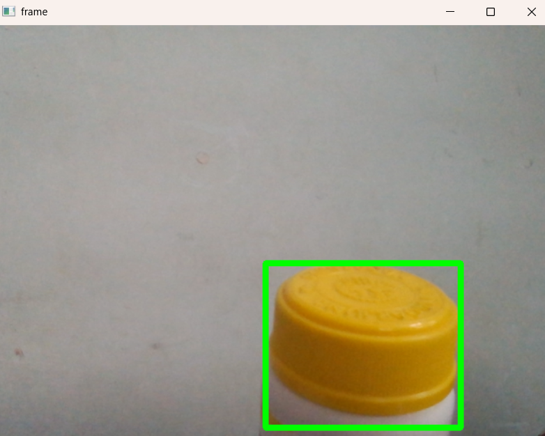
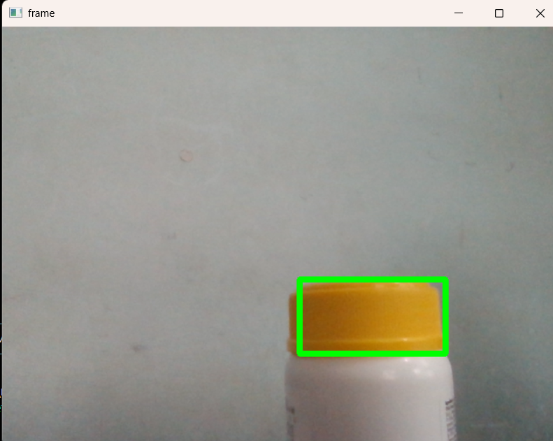

# Color Detection with OpenCV

A simple computer vision project that detects a specific color in real-time using a webcam and draws a bounding box around the detected object.

## Features

* Detect a target color in webcam frames
* Convert frames to HSV color space for robust color detection
* Generate a mask for the selected color
* Draw a bounding box around the detected region

## Technologies Used

* Python
* OpenCV
* Pillow (PIL)

## How It Works

1. Capture frames from the webcam.
2. Convert the frame from **BGR to HSV color space**.
3. Define HSV limits for the target color.
4. Create a mask highlighting the selected color.
5. Detect the bounding box around the colored region.
6. Draw a rectangle around the detected object.

## Project Structure

```
color-detection
│
├── main.py
├── util.py
├── output
│   ├── output1.png           
│   └── output2.png           
├── requirements.txt
└── README.md
```

## Example Output

Detected colored object from different angles:

| Output 1 | Output 2 |
|----------|----------|
|  |  |

## Installation

Clone the repository:

```
git clone https://github.com/ankithathecoder/Color-Detection-Tracker.git
cd Color-Detection-Tracker
```

Install dependencies:

```
pip install -r requirements.txt
```

## Usage

Run the script:

```
python main.py
```

Press **Q** to exit the webcam window.

## Notes

The script currently detects a predefined color (yellow).
You can modify the target color by adjusting the HSV values in the code.
